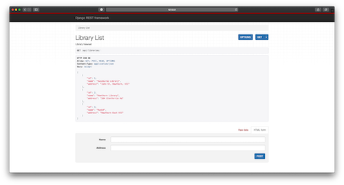
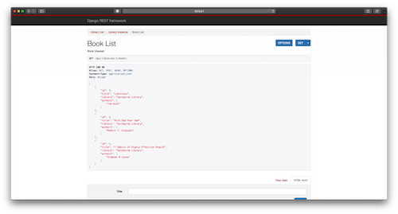

# Demo Django Nested Routers URL
This demo is to help you to understand how to use django-drf-nested-router in your project.

### Usage
This project includes the Dockerfile and docker-compose.yml to help you set up easily without requiring to install dependencies.

```sh
$ docker-compose up --build
```
### Docker
The Docker uses `python:3.8-alpine` for the OS environment and the database uses Postgresql version `postgres:10-alpine`. The reason I use alpine is because it is fast to build, you can change to the OS environment that you like :)

### Requirements
The dependencies of the project has been attached in the `requirements.txt`. 
* Django>=3.1.0,<3.1.9
* djangorestframework>=3.11.1,<3.11.9
* psycopg2>=2.8.5,<2.8.9
* drf-nested-routers==0.91

### Results

